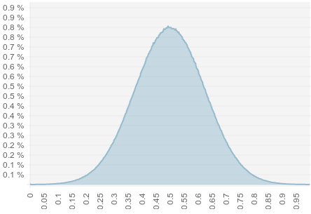
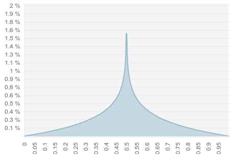
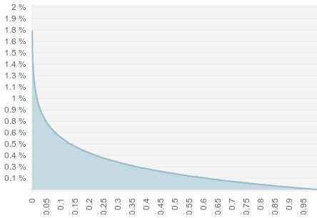
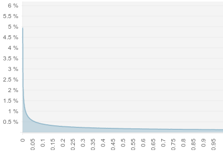
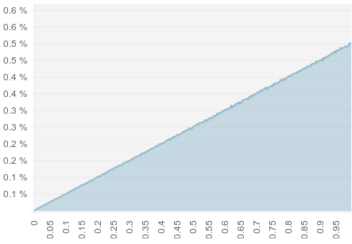
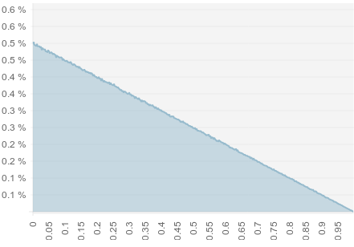

Rand
==========

A javascript class which provides random numbers with different distributions

[](https://travis-ci.org/halmhatt/rand)

### Download
Please download [rand.min.js](rand.min.js) or [rand.js](rand.js).

## Usage
```js
// Get a random number between 0 and 10 with "double exponential"
// distribution (ex. 0.4623468576464802)
Rand.random(0, 10, 'double-exponential');
```

This is a distribution that has a high probability in the middle and then *"dies out"* in both directions.

To use the normal random function, use the *random* or *constant* distribution

```js
// Just a random number between 0 and 1 (ex. 0.3653468576464802)
Rand.random();

// Same as
Rand.random(0, 1, 'constant');
```

## Random values

### Boolean
```js
// Get a boolean value (true or false)
Rand.bool();

// Get a boolean value with a 60% probability of beeing true
Rand.bool(0.6);
```

### Integer
```js
// A random integer between 0 and 1, ah yeah! (ex. 1 or 0)
Rand.int();

// A random integer between 0 and 26 (ex. 13)
Rand.int(0, 26);

// Use a different probability distribution (ex. 13)
Rand.in(0, 26, 'double-exponent');
```

### Hashes
```js
// A random hash with 40 hexadecimal chars (0-f) (ex. "c3d0b51b42205d039e0a06e1f221d2f742aa59c1")
Rand.hash();

// Random hash with a length of 32 chars (ex. "f5495b546aa984a74a2cc45f08917147")
Rand.hash(32);
```

#### Base 64
Hash with lowercase, uppercase, numbers and +/
```js
// A base64 encoded hash, 40 chars long (ex. "DbVUCEY5cTu9Tb9eMmWjuioKqM/bEUrMsR5rPjea")
Rand.base64();

// Or defined length (64 chars long)
// (ex. "IfgBO2And5NnhDkC4l97ZyUWZI8/WEMqCv+mn/DFFurEsETYLihLK8plT4ni237A")
Rand.base64(64);
```

#### Base 36
Hash with lowercase and numbers
```js
// Random base36 encoded hash, 40 chars long (ex. "n0f4612gxtzi8z3w8fusgo12ihycnpcq711f134z")
Rand.base36();

// Or defined length (86 chars long)
// (ex. "1nrrb10whkwz1i38he91iqh0wylv1x0xn1tk1jy1na2561w21201kv951eg1ui29u1p0mrkjdk1v5j5289paf6")
Rand.base36(86);
```

### Date
```js
// A random date between now and 1 year from now (ex. Thu Apr 03 2014 16:38:14 GMT+0200 (CEST))
Rand.date();

// A random date between two dates
Rand.date(new Date('2013-05-12'), new Date('2014-02-21'));
```

### Choose from array
You can make `Rand` choose a value from an array

```js
// Pick random item from array (ex. 'blue')
Rand.choose(['red', 'green', 'blue', 'orange', 'pink']);

// Choose with a different distribution, (ex. 'red' most of the times)
Rand.choose(['red', 'green', 'blue', 'orange', 'pink'], 'exponential')

// If you provide an empty array the function will return null
Rand.choose([]); // null

// Or even
Rand.choose(); // null
```

### Colors
```js
// A random hexadecimal color (ex. "#7e39b5")
Rand.color();

// A random rgba color (ex. "rgba(196,234,50,0.16)")
Rand.rgba();
```

### Other stuff
```js
// Random character (ex. 'a')
Rand.char();
```

## Distributions
The `Rand` library has some build in distributions that you can use in some functions, for example `Rand.random(min, max, distribution)`.

Use a string identifier for the distribution, default is `random` which is random over the whole range.

```js
Rand.random(0, 1, 'random');
```

The distributions are shown in histograms below, meaning that the graphs represents the **probability of x** in 10 million runs. For example the `double-exponential` distibution where 0.5 has the highest probability of about 1.6%.


### Normal
The `normal` distribution has a bump in the middle, used a lot!



To use the `normal` distribution like so:

```js
Rand.random(0, 1, 'normal');
```

### Double exponential
The `double-exponential` or `stable` distribution has a sharp edge at 0-1 (middle of range, if you use Rand.random(0, 10) then the edge will be at 5)
and then dies out **exponential in both directions**



To use this distribution use `double-exponential` or `stable` like so:

```js
Rand.random(0, 1, 'double-exponential');
```

### Exponential
The `exponential` distribution dies out exponantially in one direction



To use this distribution use `exponential` like so:

```js
Rand.random(0, 1, 'exponential');
```

### Survival
The `survival` distribution is much like the `exponential` one, excep survival has another *"tail"*



To use this distribution use `survival` like so:

```js
Rand.random(0, 1, 'survival');
```

### Linear
`Rand` has 2 linear distributions, `linear-increase` and `linear-decrease`.

The `linear-increase` looks like this



And `linear-decrease` looks like this



To use these distributions use `linear-increase` or `linear-decrease` like so:

```js
Rand.random(0, 1, 'linear-increase');
Rand.random(0, 1, 'linear-decrease');
```